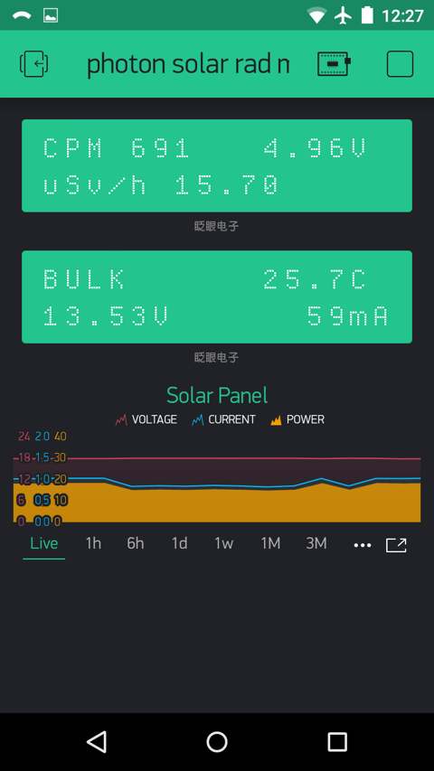
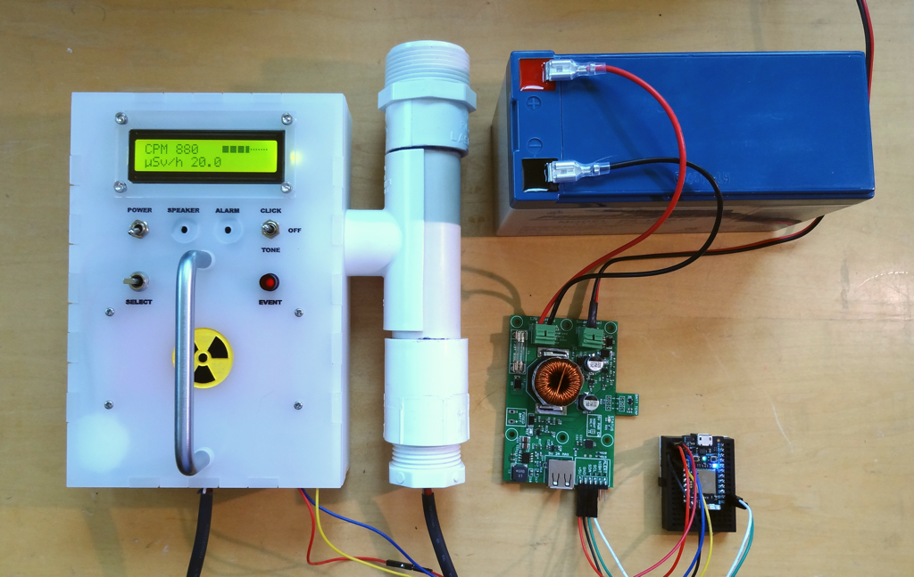
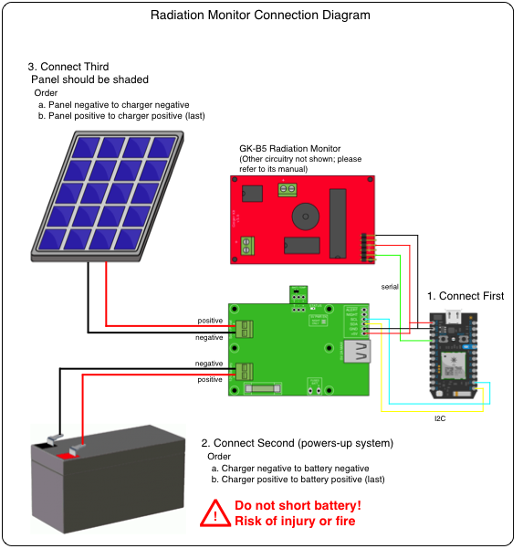
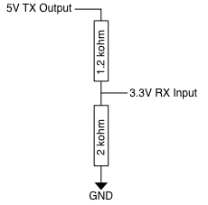

# Remote Sensing with DIYgeiger / Particle.io / Bylnk.io
The makerPower™ charger is the perfect power source for remote sensing applications and works well with [particle.io](https://www.particle.io/) development boards.  This example pairs a Particle Photon with the inexpensive but full-featured [DIYgieger GK-B5 Geiger Counter](https://sites.google.com/site/diygeigercounter/home/software-features) to remotely report radiation count-per-minute (CPM) and Dose information, along with battery voltage, load current and solar charging values on a smart phone using a free [Blynk](https://blynk.io/) account and their app.



The system is comprised of two components.  A simple program runs on the particle Photon and uses the Blynk library to upload real-time data from the raditation monitor and charger to the Blynk servers.  A simple layout consisting of three widgets is created on the Blynk app to display the data.

The Blynk app displays CPM, dose and radiation monitor supply voltage in one simulated LCD display.  It displays charge state, temperature, battery voltage and load current in a second simulated LCD display and solar panel voltage, output current and computed power on a graph.



A big shout-out to my friend, Bitreaper, who loaned me his excellent GK-B5 build.

### Cellular ready
While I used a Particle Photon because that's what I had, truly remote monitoring can be had using cellular modules such as the [Boron](https://docs.particle.io/datasheets/cellular/boron-datasheet/).  The code provided this in example should port easily to the Boron.

## Hardware
The GK-B5 provides a FTDI-cable interface.  We use this to provide 5V power to the geiger counter and get its default 9600 baud serial telemetry into the Photon.

 

| Charger | Photon | GK-B5 FTDI Header |
|---------|--------|-------------------|
|    5V   |   VIN  |         +         |
|   GND   |   GND  |         -         |
|   SDA   |    D0  |                   |
|   SCL   |    D1  |                   |
|         |    RX  |        TX         |

### Logic Level Note
The GK-B5 TX Serial output is a 5V logic level.  The Photon has 5V tolerant inputs so the output can be connected directly to the Photon RX input.  However other boards like the Boron are 3.3V logic-only.  The TX output should be connected through a voltage divider such as the following 1.2 k-ohm/2 k-ohm resistor pair.



## Firmware
The Photon sketch is in the ```photon_solar_rad_mon``` directory.  It can be pasted into the web interface, or locally compiled using Workbench.  You will need an account and have linked your Photon with your account and local WiFi.

Firmware operation is very simple.  The Photon attempts to connect the the local WiFi before starting the sketch.  Once it has connected, it runs the sketch.  The sketch performs the following functions.

1. Connect the the Blynk server using a unique Authorization Token.
2. Blink the LED on D7 every second to indicate the firmware is running.
3. Periodically read several values from the charger via the I2C interface and upload them to the Blynk server.
4. Receive and parse incoming serial data from the geiger counter, uploading values when a complete record is received.

The sketch includes a version of the makerPower arduino library.  It requires you add the official Blynk library for the particle.io family of development boards.  This may be directly included from the IDE.

### Blynk Authorization Token
Replace the text ```YOUR_AUTH_STRING_HERE``` in the string stored in the ```auth``` variable with the token you get when creating a project in the Blynk app (see below) before compiling.

### Update rates
The sketch updates data from the charger every two seconds by default.  It updates data from the geiger counter as it is available.  The GK-B5 firmware outputs data once per minute by default.  This may be changed using the remote control and menu system provided with the GK-B5 kit.


## Blynk App
The Blynk App allows creation and running of the user interface directly.  The process is well documented on their [website](https://blynk.io/en/getting-started).

My layout can be duplicated by using the QR function built into the app using the following QR code.  Bring up the app, touch the QR-code icon and aim the phone's camera at the image.  You will use your own authentication token provided by the app in the Photon sketch.


It is easy to change the layout to use different widgets.  Note that the free account provides for a limited number of widgets and you may have to delete some to make room for others.

The sketch uses the following virtual pins to communicate with the Blynk app.  Virtual pins, in the Blynk environment, are used to communicate all types of data.

1. V0 - Solar Panel voltage (V) used in the SuperChart widget
2. V1 - Solar Panel current (A) used in the SuperChart widget
3. V2 - Solar Panel computed Power (W) used in the SuperChart widget
4. V3 - Data stream for LCD1 configured in Advanced mode
5. V4 - Data stream for LCD2 configured in Advanced mode

Since the LCD widgets are configured to use the Advanced mode (operates like the traditional Arduino LCD library), the sketch will need to be slightly modified to send their data streams to other widget types.